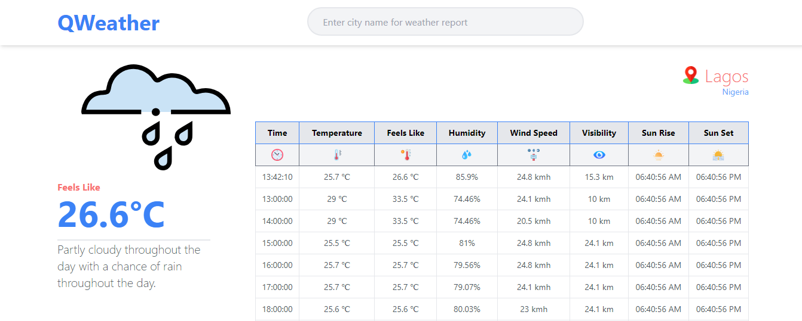

# Qweather
# Real-Time Weather App



This is a real-time weather app that I have developed for fetching accurate weather report for any location. The app provides up-to-date weather information for any location, allowing users to check the current weather conditions and forecasts easily.

## Features

- Real-time weather data from a reliable weather API
- Responsive design for seamless use on various devices
- Intuitive and user-friendly interface
- Automatic location detection for quick weather updates
- Redux integration for state management
- Comprehensive unit testing with Vitest and Testing Library/React
- Deployed to the web using Vercel for easy access

## Technologies Used

- Vite: A fast build tool for modern web development
- React: A popular JavaScript library for building user interfaces
- Redux: A predictable state container for managing application state
- Tailwindcss: A utility-first CSS framework for rapidly building custom designs.
- Weather API: A reliable API to fetch real-time weather data
- Vercel: A platform for deploying web applications with ease
- Vitest: A testing tool for Vite applications
- @testing-library/react: A testing utility for React components

## Installation

1. Clone this repository to your local machine.
   ```bash
   git clone https://github.com/xyzeebit/weather-app.git
   ```
2. Navigate to the project directory.
   ```bash
   cd weather-app
   ```
3. Install the dependencies using npm or yarn.
   ```bash
   npm install
   ```
   or
   ```bash
   yarn install
   ```

## Usage

1. Obtain an API key from the weather API provider (VisualCrossingWebServices) and replace `'VITE_WEATHER_KEY'` in the `.env` file with your actual API key.
2. Start the development server.
   ```bash
   npm run dev
   ```
   or
   ```bash
   yarn dev
   ```
3. Open your browser and navigate to `http://127.0.0.1:5173/` to view the app.

## Testing

Run the unit tests with the following command:
```bash
npm run test
```
or
```bash
yarn test
```

## Deployment

The app is deployed and can be accessed at: [https://qweather-nu-vercel.app](https://qweather-nu-vercel.app)

## Contributions

I welcome contributions to this project. If you find any issues or have suggestions for improvements, feel free to open a pull request.

## License

This project is licensed under the MIT License - see the [LICENSE](LICENSE) file for details.

---

Thank you for checking out my real-time weather app! If you have any questions or feedback, feel free to reach out to me. Happy weather checking! 🌦️